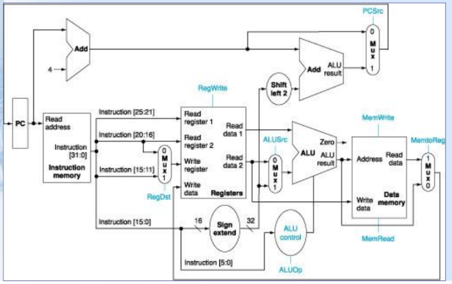

# Revisão para a prova 1

## Introduzindo VHDL

A linguagem VHDL é uma linguagem `descritiva` , ou seja, não é uma linguagem de programação.

Nela podemos descrever hardware e sua criação fica bem mais facilitada devido a simplificação de PROCESSos como levantamento de expressões lógicas e simplificações.

Vamos direto aos assuntos mais importantes.

## Estruturas principais de um arquivo VHDL

Não há diferenciação dentre letras minúsculas e maiúsculas.

A atribuição de valores é realizada com o operador `<=`

Exemplo:

``` VHDL
    Y <= A and B ;
```

### Bibliotecas/ pacotes

De forma similar a outras linguagens, é possível incluir bibliotecas que adicionam funções prontas ao nosso hardware.

Exemplo:

``` VHDL
use ieee.std_logic_1164.all ;
```

Essa biblioteca adiciona a maioria do que é preciso para programas mais simples.

### Entidades

Uma entidade em VHDL define a interface de um módulo, especificando suas portas de entrada e saída. Na declaração da entidade, você deve incluir o nome da entidade e as portas, que são descritas com seus tipos (como `in`, `out`) e tamanhos. A entidade serve como o esqueleto que será usado para criar a arquitetura.

```VHDL
ENTITY votador IS
    PORT(A, B, C: IN STD_LOGIC;
         Y: OUT STD_LOGIC);
END votador;
```
+ **IN**: Linhas de entrada.
+ **OUT**: Linhas de saída.
+ **PORT**: comando que cria as portas de entrada e saída da entidade.
+ **STD_LOGIC**: tipo que possui os valores lógicos 1 e 0. (Existem outras atribuições mas elas não são interessantes no momento).

### Architecture

A parte architecture em VHDL define a implementação interna da entidade. É onde você descreve como o comportamento do módulo é realizado.

Estrutura da Architecture:

+ Nome da Architecture: Começa com a palavra-chave `architecture`, seguida por um nome e a palavra-chave `of`, que indica a entidade a qual a arquitetura pertence.

+ Declarações de Sinais: Aqui, você pode declarar sinais internos que serão usados para conectar diferentes partes do circuito.

+ Componentes: Se você estiver instanciando outras entidades dentro da arquitetura, pode declarar esses componentes e suas interconexões.

+ PROCESSos: Se necessário, você pode incluir PROCESSos para descrever comportamentos sequenciais ou combinacionais, utilizando sinais e variáveis.

+ Atribuições: Você pode usar atribuições para definir como as saídas depENDem das entradas.

**ATENÇÃO:** Diferente de liguagens de programação, não há ordem de prioridade de execução nas instruções declaradas nesse módulo.
Para resolver essa questão utilizamos o comando `PROCESS` .

``` VHDL
ARCHITECTURE arch OF exemplo IS
    SIGNAL temporario : std_logic;  -- Declaração de um sinal interno
BEGIN
    -- Comportamento do módulo
    PROCESS (entrada) 
    BEGIN
        temp <= entrada and '1';  -- Exemplo de lógica combinacional
    END PROCESS;

    saida <= temp;  -- Atribuição da saída
END arch;
```

### Barramentos de dados

Funcionam como se fossem vetores, e são declarados da seguinte forma:

```VHDL
ENTITY exemplo IS
    PORT(
        A,B: IN STD_LOGIC_VECTOR(3 DOWNTO 0)
    );
END exemplo;
```
Quando declarados da forma acima foi usado o modo little endian de representação, nesse modo os bits mais signicativos ficam na direita.

### Reutilização e criação de novos componentes

Os port maps em VHDL são usados para conectar as portas de uma entidade a sinais externos ou a portas de outras entidades durante a instância de um componente. Eles permitem que você conecte corretamente as entradas e saídas, garantindo que a comunicação entre os módulos ocorra de maneira adequada.

Estrutura do Port Map:
Instância do Componente: Você declara uma instância do componente que deseja usar.

Port Map: Após a instância, você usa a palavra-chave `port map` para especificar as conexões.

Conexões: Dentro do port map, você lista as portas do componente seguidas pelas correspondentes variáveis ou sinais externos.

```VHDL
-- Trecho de código onde é criado um componente para utilização em outro

L1: entity work.exemplo port map(C,D);
```
## Microarquiteturas


### De ciclo único

Irei citar somente alguns assuntos mais especificos por aqui, começando por uma revisão da divisão de bits das instruções:

~

Os sinais de controle devem decidir de onde vão pegar os operandos, em instruções do tipo R o registrador de destino é `rd` , enquanto no tipo I é `rt`.



+ RegDst = seleciona de quais bits serão lidas os dados.

+ RegWrite = habilita a escrita no banco de registradores

+ ALUSrc = De onde vem o 2° operando para A ULA, dos registradores ou de um imediato.

+ PCSrc = Decide se o pc será somente incrementado em 4 ou se haverá desvio.

+ MemRead = Quando ligado habilita a leitura da memória.

+ MemWrite = Quando ligado habilita a escrita na memória.

+ MemtoReg = o que será gravado vem da memória ou é resultado da ULA?

+ ALUop = sinal de 2 bits que diz o que a ULA deve fazer

    + 00 - somar (somar o pc)

    + 01 - subtrair (calculo para beq)

    + 10 - Verificar o campo de função da instrução

    + 11 - não há utilização.

Amanhã implementação multiciclo e continuação...