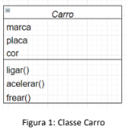
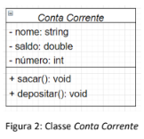

# Primeiramente, o que é POO?

**Definição:** é uma forma de programação que utiliza os conceitos de classes e objetos para representar dados.

Um breve histórico:

*   Surgiu na década de 60 ( Simula 67)
*   Foi aprimorada na década de 70 (Smalltalk)
*   Popularizou-se na década de 90 (C++ e Java)

Na POO um programa é um conjunto de objetos que interagem entre si para resolver o objetivo da aplicação.

## O que é um objeto?

Um objeto representa alguma coisa do mundo real ou computacional, algo que fará parte da solução do nosso problema.

Os objetos possuem características pelas quais os identificamos, chamadas de **atributos** (ou campos ou variáveis de instância) e também compartamentos, chamados de **métodos** .

Exemplo:

Objeto: Um carro da Ferrari

**Atributos**   (o que o objeto é ou tem?):

    Marca: Ferrari
    Placa: ABC 1234
    Cor: Vermelha

**Métodos**     (o que esse objeto faz?):

    Ligar
    Acelerar
    Freiar

**IMPORTANTE -->** Geralmente atributos são nomeados com substantivos pois representam uma característica e métodos são representados por verbos pois representam uma ação.

## O que é uma classe?

Uma classe define um grupo de objetos que possuem atributos e métodos em comum, é um molde a partir do qual os objetos são criados.

Portanto classes são abstratas(Não existem na memória) enquanto objetos são concretos(Existem) .

Por exemplo:

Classe Carro

**Atributos**   (o que o objeto é ou tem?):

    Marca
    Placa
    Cor

**Métodos**     (o que esse objeto faz?):

    Ligar
    Acelerar
    Freiar

A partir desa classe podem ser gerados três objetos da classe Carro: Ferrari, Celta e HB20.

Ressaltando mais uma vez, objetos ocupam espaços na memória, enquanto uma classe é apenas uma ideia do que um objeto dessa classe deve ser e o que ele deve fazer.

A classe carro, usando UML¹, pode ser representada pelo diagrama de classes mostrado na figura 1.



¹ UML (Unified Modeling Language) é uma ferramenta para modelagem de aplicações computacionais, e
é usada aqui apenas para facilitar a representação de classes.

Não precisamos colocar todos as possibilidades em uma classe, apenas o que é importante para a aplicação desenvolvida, a capacidade de decidir o que vai ser colocado ou não cabe ao projetista da classe e é chamada de **abtração**.

## Exemplo de classe em Java

Consideremos a seguinte classe:



Os símbolos + e - estão relacionados aos modificadores **public** e **private** que serão explicados daqui para frente.

``` Java
    public class ContaCorrente{
        private String nome ;
        private double saldo ;
        private int numero ;

        public void depositar(double valor){
            saldo = saldo + valor ;
        }
        public void sacar(double valor){
            saldo = saldo - valor ;
        }
    }
```
Note que Java usa sintaxe parecida com C++ e os atributos são listados primeiro e os métodos depois.

**IMPORTANTE -->** Por convenção usamos nomes de classes iniciando por letras Maiúsculas e atributos e métodos começando por minúsculas.

